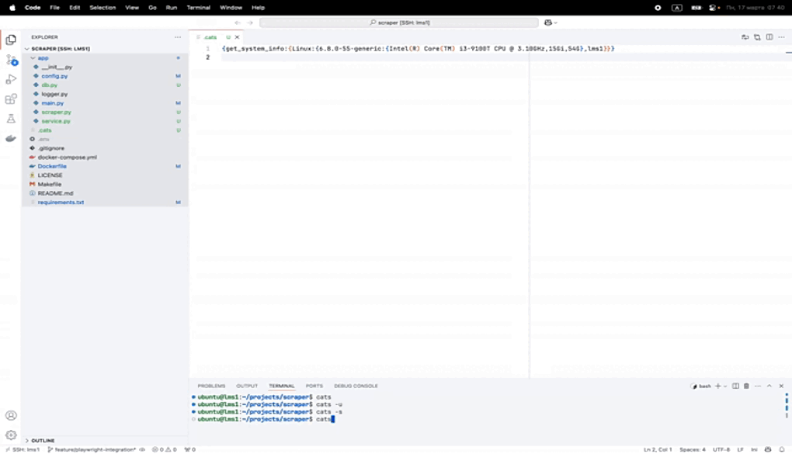

`Concept Project: This project is currently a concept. It serves as an early-stage exploration of a potential tool for gathering and organizing system information. The goal is to prototype different functionalities and evaluate their feasibility before developing a fully-fledged utility.`


# 🐾AI Utilities Toolkit

The `cats` utility helps extract and provide relevant context about the file system structure, operating system, network, and user to facilitate better interactions with artificial intelligence, ensuring it can make more accurate and context-aware decisions during development.

# cats
A utility named after my little cats, who love cleaning up on my tables, shelves, and cabinets. They knock all the unnecessary things off onto the floor, leaving only the most important and useful ones. This utility works in the same way: it helps send only the necessary files and data to your clipboard, keeping your workflow clean and focused on the important parts of development.



## Installation and Usage

To install and run the `cats` program, execute the following command in your terminal:

```bash
curl -fsSL https://raw.githubusercontent.com/luminetai/cats/main/install.sh | bash
```

This command will automatically download and install the necessary files on your computer and create a symbolic link for easy access to the program.

Once installed, you can use the `cats` command to perform tasks.

---


## Help and Flags  

The `cats` program accepts several flags that control its behavior. You can pass one, two, or even more flags in any order. If no flags are provided, the program will execute all actions by default.  

### Available Flags:  
- **-d, --directory**: Get directory structure  
- **-n, --network**: Get network information  
- **-s, --system**: Get system information  
- **-u, --user**: Get user information  
- **-p, --python-packages**: Get installed Python packages  
- **-a, --all-packages**: Get all installed packages 
- **-h, --help**: Show help  

### Usage Examples:  

**Without flags**:  
Running the `cats` command without any flags will execute all available actions:  
```bash
cats
```

**With a single flag**:  
You can pass a single flag to execute a specific action:  
```bash
cats -d
cats -n
cats -s
cats -u
cats -p
cats -a
```

**With multiple flags**:  
You can pass multiple flags to execute different actions in any order:  
```bash
cats -dns
cats -up
cats -apd
cats -unsa
```
